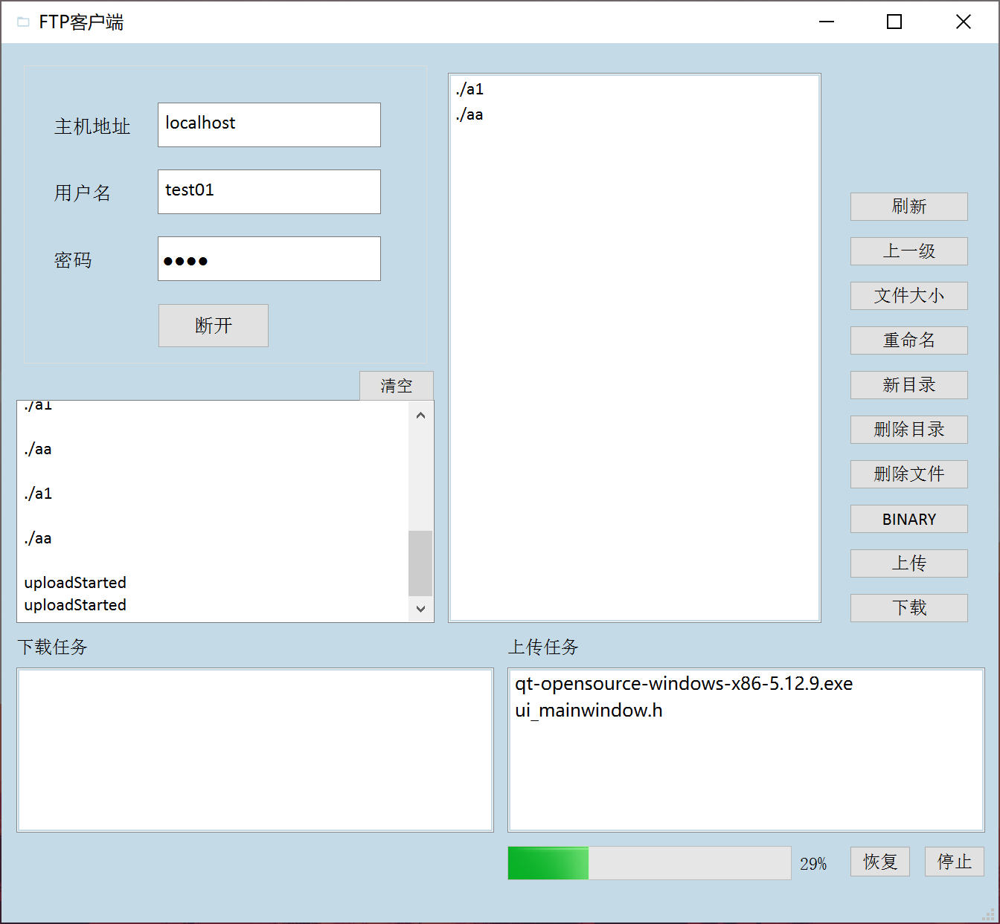

# FTP 客户端
## 简介
大二第三学期计网课程设计：FTP 客户端

## 小组成员
-  [朱华彬](https://github.com/zhb2000)
-  [郑彦翀](https://github.com/ZYChimne)

## 开发相关
FTP 协议使用 Win32 API [WinSock2](https://docs.microsoft.com/en-us/windows/win32/api/winsock2/) 实现，用户界面使用 [Qt](https://www.qt.io/) 构建，客户端在 Windows 系统下运行。

开发环境：

- Qt Version: Qt 5.12.9
- Library: Ws2_32.lib (in MSVC) / libws2_32.a (in MinGW)
- System: Windows 10
- Compiler: MinGW-w64 8.1.0
- Language: C++11

## 计划表
- [x] 连接到服务器
- [x] 登录
- [x] 切换 ASCII 和 Binary 传输模式
- [x] 切换到被动模式（PASV/EPSV）
- [x] 读取当前路径
- [x] 切换路径
- [x] 列出当前目录的文件
- [x] 创建目录
- [x] 删除目录
- [x] 获取文件大小
- [x] 重命名文件
- [x] 删除文件
- 下载文件相关
    - [x] 下载文件
    - [x] 中途停止下载
    - [x] 下载进度
    - [x] 断点续传
- 上传文件相关
    - [x] 上传文件
    - [x] 中途停止上传
    - [x] 上传进度
    - [x] 断点续传
- [x] 图形界面