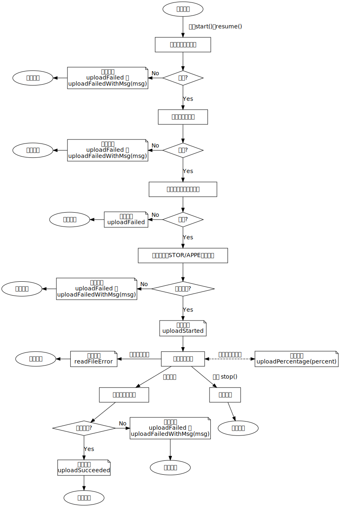

# 文档
## FTPSession
### 概述
FTPSession 对象中存放着 FTP 控制连接，它封装了登录、列出文件名、改变工作目录、删除文件等操作，详见下面的“功能”小节。

为了防止界面被卡死，FTPSession 的成员函数以异步的方式工作，运行结束后发射信号通知调用者。

### 初始化
首先，创建一个对象。

```cpp
FTPSession *se = new FTPSession(hostname, username, password, port);
```

然后，因为 FTPSession 有关操作都是异步函数，执行结果会通过信号通知调用方，所以要先连接好信号和槽。

```cpp
// connectAndLogin
QObject::connect(se, &FTPSession::connectSucceeded,
                 [](string welcomeMsg) { /*...*/ });
QObject::connect(se, &FTPSession::connectFailedWithMsg, 
                 [](string msg) { /*...*/ });
QObject::connect(se, &FTPSession::connectFailed,
                 []() { /*...*/ });
QObject::connect(se, &FTPSession::createSocketFailed,
                 []() { /*...*/ });
QObject::connect(se, &FTPSession::unableToConnectToServer,
                 []() { /*...*/ });
QObject::connect(se, &FTPSession::loginSucceeded,
                 []() { /*...*/ });
QObject::connect(se, &FTPSession::loginFailedWithMsg, 
                 [](string msg) { /*...*/ });
QObject::connect(se, &FTPSession::loginFailed,
                 []() { /*...*/ });
// getFilesize
QObject::connect(se, &FTPSession::getFilesizeSucceeded,
                 [](int size) { /*...*/ });
QObject::connect(se, &FTPSession::getFilesizeFailedWithMsg, 
                 [](string msg) { /*...*/ });
// getDir
QObject::connect(se, &FTPSession::getDirSucceeded,
                 [](string dir) { /*...*/ });
QObject::connect(se, &FTPSession::getDirFailedWithMsg, 
                 [](string msg) { /*...*/ });
QObject::connect(se, &FTPSession::getDirFailed,
                 []() { /*...*/ });
// changeDir
QObject::connect(se, &FTPSession::changeDirSucceeded,
                 []() { /*...*/ });
QObject::connect(se, &FTPSession::changeDirFailedWithMsg, 
                 [](string msg) { /*...*/ });
QObject::connect(se, &FTPSession::changeDirFailed,
                 []() { /*...*/ });
// setTransferMode
QObject::connect(
    se, &FTPSession::setTransferModeSucceeded, 
                 [](bool binary) { /*...*/ });
QObject::connect(se, &FTPSession::setTransferModeFailedWithMsg,
                 [](string msg) { /*...*/ });
QObject::connect(se, &FTPSession::setTransferModeFailed,
                 []() { /*...*/ });
// deleteFile
QObject::connect(se, &FTPSession::deleteFileSucceeded,
                 []() { /*...*/ });
QObject::connect(se, &FTPSession::deleteFileFailedWithMsg, 
                 [](string msg) { /*...*/ });
QObject::connect(se, &FTPSession::deleteFileFailed,
                 []() { /*...*/ });
// makeDir
QObject::connect(se, &FTPSession::makeDirSucceeded,
                 []() { /*...*/ });
QObject::connect(se, &FTPSession::makeDirFailedWithMsg, 
                 [](string msg) { /*...*/ });
QObject::connect(se, &FTPSession::makeDirFailed,
                 []() { /*...*/ });
// removeDir
QObject::connect(se, &FTPSession::removeDirSucceeded,
                 []() { /*...*/ });
QObject::connect(se, &FTPSession::removeDirFailedWithMsg, 
                 [](string msg) { /*...*/ });
QObject::connect(se, &FTPSession::removeDirFailed,
                 []() { /*...*/ });
// renameFile
QObject::connect(se, &FTPSession::renameFileSucceeded,
                 []() { /*...*/ });
QObject::connect(se, &FTPSession::renameFileFailedWithMsg, 
                 [](string msg) { /*...*/ });
QObject::connect(se, &FTPSession::renameFileFailed,
                 []() { /*...*/ });
// listDir
QObject::connect(se, &FTPSession::listDirSucceeded,
                 [](vector<string> dirList) { /*...*/ });
QObject::connect(se, &FTPSession::listDirFailedWithMsg, 
                 [](string msg) { /*...*/ });
QObject::connect(se, &FTPSession::listDirFailed,
                 []() { /*...*/ });
```

连接好信号和槽之后，调用 `connectAndLogin` 即可连接服务器并登录。

```
se->connectAndLogin();
```

### 功能
#### 连接服务器并登录
`connectAndLogin`

- 可从 `connectSucceeded(welcomeMsg)` 获得服务器的欢迎信息。
- `loginSucceeded` 表示登录成功。命名为"xxx**Succeeded**"的信号都表示某项操作成功。
- `connectFailedWithMsg(msg)` 和 `loginFailedWithMsg(msg)` 表示服务器消息中的返回码不符合预期。命名为"xxx**FailedWithMsg**"的信号皆是如此。
- `connectFailed` 和 `loginFailed` 表示执行 `send` 或 `recv` 函数时出现了错误。命名为"xxx**Failed**"的信号皆是如此。
- `createSocketFailed` 表示创建 socket 失败。
- `unableToConnectToServer` 表示执行 `connect` 函数时无法连接到服务器。

#### 设定传输模式
`setTransferMode`

如果是通过调用 `connectAndLogin` 登录的，那么传输模式会被自动设置为 Binary 模式。

如果调成 ASCII 模式，图片等二进制文件被传输后会失效。

#### 获取当前目录中的文件名
`listWorkingDir`

- 可从 `listWorkingDirSucceeded(dirList)` 信号中得到文件名
- 如果你把参数 `isNameList` 设为 true，那么获得的就不单是文件名，还包括了其他信息，比如下面这样的

```
-rw-r--r-- 1 ftp ftp          13661 Jul 16 09:48 pic.jpg
-rw-r--r-- 1 ftp ftp             27 Jul 11 00:22 read.md
-rw-r--r-- 1 ftp ftp             20 Jul 12 21:58 text.txt
```

然而 FTP 协议没有规定返回文件信息的格式，所以每个 FTP 服务器都有点不一样，解析起来比较麻烦……所以还是只获取文件名就好了……

#### 获取当前工作目录
`getDir`

从 `getDirSucceeded(dir)` 信号中获取当前工作路径

#### 改变工作目录
`changeDir`

#### 删除文件
`deleteFile`

#### 重命名文件
`renameFile`

#### 获取文件大小
`getFilesize`

从 `getFilesizeSucceeded(size)` 信号中获取文件大小，单位：字节

#### 创建目录
`makeDir`

#### 删除目录
`removeDir`

必须先把目录中的文件全部删除，然后才能删目录，否则服务器会拒绝删除。递归删除得自己写，这个我没弄。

## UploadFileTask
### 概述
每个 UploadFileTask 对象都代表着一个上传任务，通过成员函数控制任务的开始、停止、续传。

当任务状态发生变化时，对象会发射信号通知调用方。

你可以创建多个对象，同时上传多个文件。

### 初始化
首先创建一个对象。

注意参数 `remoteFilepath` 要传入**绝对路径**，要不然文件会存到服务器根目录下。

```cpp
std::ifstream ifs(localFilepath, std::ios_base::in | std::ios_base::binary);
UploadFileTask *task = new UploadFileTask(*se, remoteFilepath, ifs);
```

由于 UploadFileTask 相关操作是异步函数，因此需要连接信号和槽。

```cpp
QObject::connect(task, &UploadFileTask::uploadStarted,
                 []() { /*...*/ });
QObject::connect(task, UploadFileTask::uploadPercentage,
                 [](int percentage) { /*...*/ });
QObject::connect(task, UploadFileTask::uploadSucceeded,
                 []() { /*...*/ });
QObject::connect(task, UploadFileTask::uploadFailedWithMsg,
                 [](string msg) { /*...*/ });
QObject::connect(task, &UploadFileTask::uploadFailed,
                 []() { /*...*/ });
QObject::connect(task, &UploadFileTask::readFileError,
                 []() { /*...*/ });
```

连接好信号和槽之后，调用 `start` 即可开始上传任务。

### 功能
#### 开始上传
```cpp
task->start();
```

当上传真正开始时（指发送文件内容到服务器），对象会发射 `uploadStarted` 信号。

#### 断点续传
```cpp
task->resume(uploadedSize);
```

用 FTPSession 对象查询一下服务器上的文件大小即可得到 `uploadedSize`。

上传真正开始时也会发射 `uploadStarted` 信号。

#### 停止上传
```cpp
task->stop();
```

#### 上传进度
上传过程中，上传百分比发生变化时，对象会发射 `uploadPercentage(percentage)` 信号。

### 流程图


## 其他
### 异步操作
写了个函数模板，简单封装了一下 `QFuture` 和 `QtConcurrent`，以实现 async-await 的效果。`#include "../include/RunAsyncAwait.h"` 即可使用。

```cpp
int longTimeWork1(int a, int b) { /*耗时的操作*/ }
void longTimeWork2(int a, int b) { /*耗时的操作*/ }
```

对于有返回值的函数，调用时需要**显式指定返回类型**，比如这里的 `<int>`。

```cpp
int result1 = utils::asyncAwait<int>(longTimeWork1, a, b);
//后面的代码在 longTimeWork1() 结束后才会执行
//......
```

对于无返回值的函数，调用时**不指定返回类型**。

```cpp
int result2 = utils::asyncAwait(longTimeWork2, a, b);
//......
```

### 收取 FTP 报文
刚开始我写的时候是直接 `recv` 取报文的，然而我忘了 TCP 是面向字节流的协议，不能保证一次读取的是一整条报文……

一条 FTP 消息必定以"\r\n"结尾，利用这个特点写了个工具函数 `utils::recvFtpMsg`，调用一次可保证收取到的是一条完整的 FTP 报文。

`#include "../include/MyUtils.h"` 即可使用。